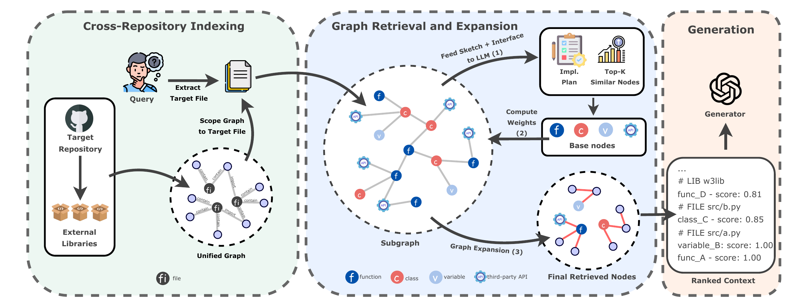

<h1 align="center">Beyond Repository Boundaries: Cross-Repository Graph Retrieval for
Code Generation</h1>


<p align="center">
  <a href="#"></a>
  <a href="https://python.org/"></a>
  <a href="#"></a>
  <a href="https://arxiv.org/abs/2609.09987"></a>
  <a href="https://huggingface.co/datasets/solis-soict/VersionExec"></a>
</p>

## Abstract

Repository-level code generation requires generated code to be compatible not only with the target repository but also with its dependency environment. Existing retrieval-based methods mainly retrieve context from the local repository, leaving external API usage dependent on the model’s pretrained knowledge, which can be insufficient for unseen or version-specific APIs. Moreover, current retrieval strategies largely focus on one-hop evidence and overlook the structural relationships among code components. We propose CrossCoder, a cross-repository code generation framework that explicitly incorporates external libraries into the retrieval context through a unified knowledge graph over repository and library entities. CrossCoder identifies important nodes via planning and semantic retrieval, then selectively expands neighboring nodes to retrieve richer multi-hop contextual evidence for generation. To further evaluate dependency-version compatibility, we introduce VersionExec, an execution-based benchmark derived from BigCodeBench that evaluates generation under different dependency versions. Experimental results on RepoExec, DevEval, and VersionExec demonstrate that CrossCoder consistently improves both functional correctness (up to 6.3% on pass@1) and robustness to dependency-version changes.

<p align="center">
  
</p>

## Setup

Create and activate the environment:

```bash
conda create -n crosscoder python=3.13.7
conda activate crosscoder
pip install -r requirements.txt
```

Extract the shared data archive:

```bash
unzip data.zip -d .
```

Set Fireworks credentials:

```bash
export FIREWORK_API_KEY=<your_fireworks_key>
export FIREWORK_BASE_URL=https://api.fireworks.ai/inference/v1
```

Use the model name after the Fireworks prefix in commands. For example, `gpt-oss-120b` becomes `accounts/fireworks/models/gpt-oss-120b` inside the pipeline.


## Process Benchmark Data

Prepare RepoExec:

```bash
cd benchmark/RepoExec
unzip test-apps.zip
cd ../..

python src/utils/process_lib.py --dataset RepoExec
python src/utils/download_lib.py --benchmark RepoExec --wrap --download
```

Prepare DevEval:

```bash
cd benchmark/DevEval
tar -xzf data.tar.gz
wget https://huggingface.co/datasets/LJ0815/DevEval/resolve/main/Source_Code.tar.gz
tar -xvzf Source_Code.tar.gz
cd ../..

python src/utils/process_lib.py --dataset DevEval
python src/utils/download_lib.py --benchmark DevEval --wrap --download
```

Prepare VersionExec:

```bash
python src/utils/download_lib.py --benchmark versionexec_old --download
python src/utils/download_lib.py --benchmark versionexec_new --download
```

## Build Graph

```bash
bash src/graph_builder/parser/run.sh --dataset <RepoExec|DevEval|versionexec_old|versionexec_new>
```

Example:

```bash
bash src/graph_builder/parser/run.sh --dataset versionexec_new
```

## Load Benchmark Samples

```bash
python src/load_benchmark.py \
  --benchmark <RepoExec|DevEval|versionexec_old|versionexec_new> \
  --extend True \
  --model <model>
```

Example:

```bash
python src/load_benchmark.py \
  --benchmark versionexec_new \
  --extend True \
  --model gpt-oss-20b
```

## Generate Plan and Graph Expansion

```bash
python src/retriever/gen_plan.py \
  --benchmark <RepoExec|DevEval|versionexec_old|versionexec_new> \
  --model <model> \
  --retriever unixcoder
```

Then, run the following script

```bash
python src/retriever/rebuild_predicted_components.py \
  --benchmark <RepoExec|DevEval|versionexec_old|versionexec_new> \
  --model <model> \
  --top_k 5
```

## Build Prompts and generate code

```bash
python src/retriever/create_prompt_rerank.py \
  --benchmark <RepoExec|DevEval|versionexec_old|versionexec_new> \
  --model <model> \
  --threshold 0.25 \
  --include_import true
```

This writes prompts to:

```text
data/prompt/
```

Then, run the following command:

```bash
python src/generator/generate.py \
  --benchmark <RepoExec|DevEval|versionexec_old|versionexec_new> \
  --model <model> \
  --num_sample 3
```

## Evaluation

Evaluate RepoExec:

Read [`benchmark/RepoExec/README.md`](benchmark/RepoExec/README.md).

Evaluate DevEval:

Read [`benchmark/DevEval/README.md`](benchmark/DevEval/README.md).

Evaluate VersionExec:

Start Docker Desktop before running the evaluation commands.

Setup VersionExec:

```bash
conda create -n versionexec python=3.10.0
conda activate versionexec

pip install -r benchmark/versionexec_old/Requirements/requirements.txt
```

Evaluate VersionExec Old:

```bash
conda activate versionexec
cd benchmark/versionexec_old

bash run_docker_full.sh \
  --clean-docker \
  --folder <output_folder_contains_jsonl_result_file>

```

Evaluate VersionExec New:

```bash
conda activate versionexec
cd benchmark/versionexec_new

bash run_docker_full.sh \
  --clean-docker \
  --folder <output_folder_contains_jsonl_result_file>

```
